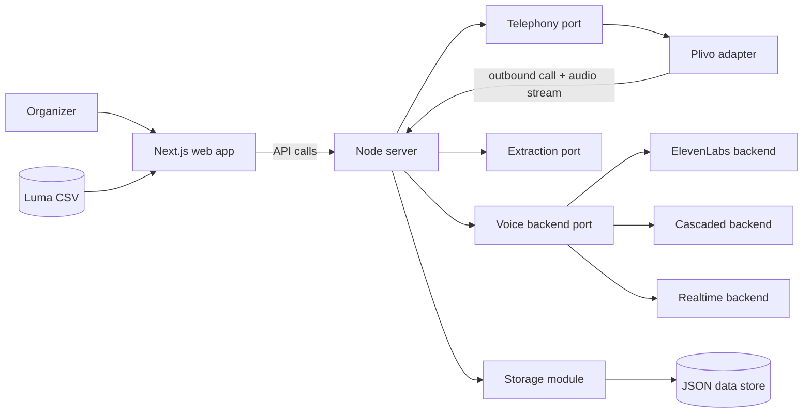

# Design

Write this after [REQUIREMENTS.md](REQUIREMENTS.md). This file is the technical source of truth. Record the implementation approach and the decisions behind it here so later agent sessions do not drift from what you already chose.

When you change architecture, APIs, or a recorded decision, update this file in the same change.

This file describes structure, responsibilities, and decisions. It contains no code. Types, routes, and file formats live in the code and may change without touching this file, as long as the boundaries described here hold.

## Overview

The system has two running processes with adapter contracts for plug-and-play providers.

- A **web app** (Next.js) is the organizer's interface and application layer. It owns product-specific domain logic: campaign rules, guest filtering and ordering, prompt assembly rules, CSV import mapping, and run orchestration policy.
- A **server** (plain Node) owns everything else: the API for the web app, telephony callbacks, the live call audio connection, the campaign runner, storage, and provider adapters.
- **Shared packages are not created by default.** Infrastructure starts as modular code inside `apps/server`. A module becomes a separate package only after it has at least two real consumers or needs an independent release cycle.

A call works like this. The runner picks the next eligible guest, and the telephony layer dials them. When the guest answers, call audio streams to our server. The server connects that audio to a **voice backend**, which runs the conversation. When the call ends, the transcript goes through one shared **extraction** step that fills in the campaign's fields. Then the runner moves on to the next guest.

Our server always sits between the phone call and the voice backend. That single choice is what makes the voice approaches swappable, comparable, and able to fall back on each other.

## Architecture diagram

## Components

**Application domain (in the web app).** Product-specific rules live in `apps/web`: guest filtering and ordering, call eligibility policy, prompt assembly policy, campaign templates, and CSV-to-domain mapping. This logic is intentionally not packaged as a shared library, because it is tightly coupled to this product's requirements and UI behavior. Keep it modular inside the app so it can be moved out later only if reuse becomes real.

**Storage (in the server).** Storage stays inside `apps/server` in phase 1. It uses a small storage interface with one JSON-file implementation. Each event gets its own folder, holding the event, its guests, each campaign, and each attempt in separate files. Separate files keep writes small and keep events isolated from each other. Writes are atomic: write a temporary file, then rename it into place.

**Guest import (in the web app).** CSV import stays in `apps/web` for phase 1 because it is small and tightly coupled to upload and preview UX. The web app parses the Luma CSV, maps statuses and known columns into a normalized guest payload, keeps unknown columns (such as custom questions) as extra attributes, shows skipped-without-phone counts, and submits the payload to the server API. The server validates before persistence.

**Telephony port (in the server).** A provider-neutral adapter contract over the phone network, with one adapter per telephony vendor. Plivo is the only adapter in phase 1. The contract offers:

- placing an outbound call to a number, tagged with the attempt it belongs to;
- call lifecycle events in neutral terms: answered, machine detected, ended with a neutral end reason (completed, busy, no answer, rejected, failed);
- a two-way audio channel in one agreed format (8 kHz mu-law in fixed-size frames, the telephony standard, which most voice providers accept directly);
- hanging up.

The Plivo adapter translates between this contract and Plivo's world: REST call creation, webhooks, response markup, answering machine detection, and the audio stream message format. Code outside the telephony module never sees a Plivo concept. The provider is picked by configuration, so another adapter (for example Twilio, Exotel, or jambonz) can be added without changing callers.

**Voice backend port (in the server).** A voice backend adapter contract. A backend receives the built prompt, the campaign language, and the two-way audio channel. It runs the conversation, reports transcript turns as they happen, and can report whether it has credits. A credit or quota failure is reported as its own error kind, separate from other failures. Planned backends:

- **ElevenLabs agent:** bridges the call audio to an ElevenLabs Conversational AI session. This is the quality baseline.
- **Cascaded:** Google speech-to-text, then an Anthropic or OpenAI LLM, then text-to-speech (Google, or ElevenLabs when credits exist). Our code handles turn-taking. This is the fallback that does not depend on ElevenLabs.
- **Speech-to-speech:** OpenAI Realtime or Gemini Live, added later.

**Extraction port (in the server).** Turns a finished transcript plus the campaign's field definitions into captured values, using one LLM call that returns structured output. Any value that is missing, unclear, or fails validation becomes unknown. Every backend goes through this same step, so results from different backends are comparable.

**Runner (in the server).** Works through a campaign's ordered queue one guest at a time. Before each dial it enforces runtime guardrails (phone present, timing window, retry cap) and uses the campaign policy prepared by the web app. It creates the attempt, dials, starts the voice backend when the guest answers, saves transcript turns as they arrive, maps the end reason to an outcome, runs extraction, and then moves to the next guest. Calling one guest on demand uses the same path with a queue of one.

**Server API.** A JSON HTTP API with operations for the web app: manage events, import guests, list and filter guests, manage campaigns (prompt, fields, language, voice backend order, calling window, queue order), start and stop a run, call one guest, check credits, and read results and summaries. The server also exposes the telephony callback endpoints and the audio WebSocket endpoint. These are defined by the telephony adapter and only reached by the telephony provider.

**Web app.** Pages for events, guest list (filter, select, reorder), campaign editing, run control, and results. It keeps results up to date by polling. Any server-side code it has is thin glue that forwards to the server API.

## Decisions

**D1. Our server always holds the call audio (2026-09-27).**
Alternative: connect Plivo straight to ElevenLabs over SIP. That gives the lowest latency and the least code, but ElevenLabs then owns the call: there is no clean fallback, transcripts come in a different shape, and other approaches can't be compared on equal terms. Bridging adds one network hop, which is acceptable.

**D2. Preferred backend per campaign plus an automatic fallback order (2026-09-27).**
Before a run, we check credits for every backend in the campaign's order. If a quota error happens while a backend session is starting, the same call switches to the next backend, which is possible because we already hold the audio (D1). If a backend fails in the middle of a conversation, that attempt ends as failed with the reason. The backend is then skipped for the rest of the run, and the following calls use the next one. Each attempt records the backend that handled it and whether a fallback happened.

**D3. One shared extraction step (2026-09-27).**
Alternative: use each provider's own data-collection feature. Rejected, because results would then depend on the backend and could not be compared fairly.

**D4. JSON files in the server, one writer, no concurrency (2026-09-27).**
Alternatives: SQLite, Postgres. JSON files are easy to inspect and enough for one organizer. The server is the only process that reads or writes them. The web app goes through the API. The runner places one call at a time. Storage is still interface-based inside `apps/server`, so a database can replace it when concurrency is needed.

**D5. Monorepo with two apps first, extract packages later (2026-09-27).**
Phase 1 keeps code in two apps: `apps/web` and `apps/server`. There are no infrastructure packages yet. The server contains modular adapter folders for telephony, voice, extraction, and storage. A module moves to `packages/` only when it has at least two real consumers, or when we need independent versioning or reuse outside this repo.

**D6. Adapter ports now, one provider implementation each in phase 1 (2026-09-27).**
Each integration layer uses a stable contract plus a runtime-selected adapter. In phase 1 we keep one implementation per layer: Plivo for telephony, ElevenLabs and cascaded for voice, and one extractor. This keeps today simple while keeping tomorrow plug-and-play.

**D7. Do not adopt jambonz now (2026-09-27).**
jambonz is a voice platform that connects SIP carriers to speech, LLM, and speech-to-speech vendors, including ElevenLabs agents, Google, and OpenAI. It would give us all three voice approaches behind one interface. Rejected for phase 1 for three reasons:
- it means running a separate SIP and media stack next to our app, and it still needs a Plivo SIP trunk;
- the free MIT edition (0.9.x) only gets bug fixes now. New features go to the commercial v10, which needs a paid license or its paid cloud;
- it would replace far more of our code than it saves at the scale of one call at a time.

Revisit if we need many telephony carriers, high concurrency, or inbound calls. When we do, it becomes another telephony adapter (D6), not a rewrite.

**D8. Minimal dependencies and incremental extraction (2026-09-27).**
Prefer Node built-ins (fetch, the built-in WebSocket client) and direct REST or WebSocket calls to providers over vendor SDKs, where the provider surface we need is small. This applies to Plivo, ElevenLabs, Anthropic, and OpenAI. We add a dependency only when writing it ourselves would be risky or large:
- Next.js (MIT) for the web app;
- a WebSocket server library (ws, MIT), because Node has no built-in WebSocket server;
- the Google Cloud Speech client (Apache-2.0) when the cascaded backend arrives, because streaming recognition runs over gRPC;
- a small CSV parser (MIT, chosen at implementation time), because Luma exports contain quoted fields with commas and line breaks.

Phone normalization and output validation are written in-house for now. Every new dependency must be free for commercial use. We also avoid premature package extraction: adapter modules stay in `apps/server` until the criteria in D5 are met.

**D9. Tests use node:test + Chai + Sinon (2026-09-27).**
Unit and integration tests replace every provider with a fake: a fake telephony adapter, a fake voice backend, and a stubbed LLM. They run under `npm test` in CI. Tests against live providers are e2e tests and run only on demand.

## Data and control flow

What enters: a Luma CSV, the event details the organizer enters, campaign settings, and the organizer's guest selection and order. During calls: audio from the guest, and call events from the telephony provider.

What leaves: audio to the guest, requests to the voice and LLM providers, and later RSVP or attendance write-backs to Luma.

Where state lives: only in the server's data folder, split by event. Provider credentials live only in the server environment. They are never sent to the web app and never written to data files.

A single call:

1. The runner enforces runtime guardrails against the selected guest, then creates an attempt.
2. Telephony dials the guest, with answering machine detection on.
3. When the guest answers, the provider opens the audio stream to the server.
4. The server builds the prompt and starts the first backend with credits.
5. Transcript turns are saved as they arrive.
6. When the call ends, the neutral end reason becomes the attempt outcome.
7. If the call was answered, extraction runs and the captured fields are saved.

The number dialed is always read from storage using the guest's id, never taken from a request. This is how a number that is not on the list can never be called.

## Error handling

- **Credit or quota failure:** fallback as in D2. Always visible on the attempt and in the run status, never silent.
- **Dial failure, busy, rejected, no answer, voicemail:** stored as the outcome, with captured fields left unknown. No automatic retry. The organizer retries explicitly, up to the campaign's cap.
- **Silence:** after a set period without guest speech, the agent closes politely and hangs up.
- **Call length:** hard cap per call, so a stuck conversation can't run forever.
- **Extraction failure:** the transcript is kept, the fields become unknown, and the error is recorded. Extraction can be re-run later.
- **Server restart during a run:** the run stops. On startup, attempts left unfinished are marked failed as interrupted. The organizer resumes the run by hand.
- **Never swallowed:** quota errors, eligibility rejections, storage write failures, and telephony callback errors. Each one ends up on the attempt or in the run status.

## Testing

`npm test` covers:

- CSV import and status mapping;
- phone normalization;
- filtering and ordering;
- eligibility rules;
- prompt building;
- atomic storage writes;
- the runner end to end with fake telephony and a fake voice backend, including fallback on quota errors;
- extraction with a stubbed LLM;
- the Plivo adapter's translation of recorded webhook and stream messages.

`npm run test:e2e` covers live voice provider sessions driven by recorded audio, live extraction, and one real outbound call to a test number.

## Build order

1. Storage and adapter ports in the server, then app-domain modules in the web app, then CSV import.
2. Plivo telephony adapter, ElevenLabs backend, extraction adapter, the runner, and the results view.
3. The cascaded backend, credit checks, and automatic fallback.
4. Speech-to-speech backends and a per-backend comparison view.
5. Luma API sync and write-back.

## Open questions

- Plivo outbound calling in India needs a compliant caller ID. Confirm the account setup before step 2.
- The default text-to-speech for the cascaded backend, and which Indian-language voices sound best.
- The default field sets for the pre-event and post-event campaign templates. This is a product question, so it belongs in [REQUIREMENTS.md](REQUIREMENTS.md) once decided.
