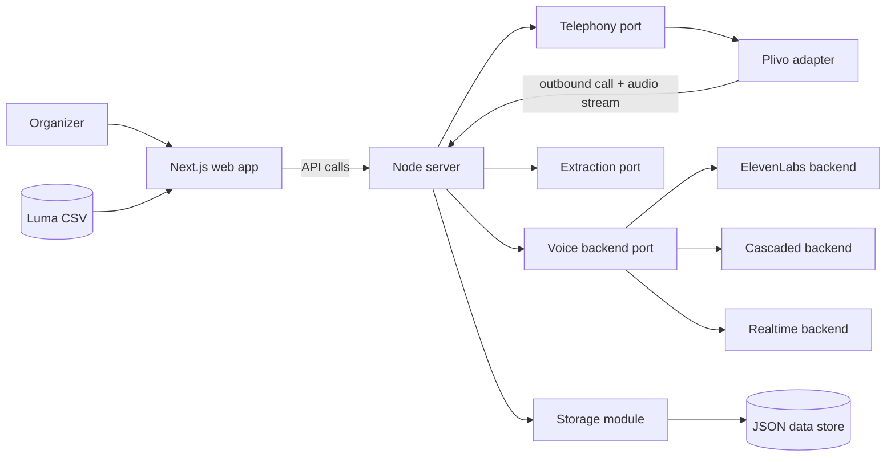

# Design

Write this after [REQUIREMENTS.md](REQUIREMENTS.md). This file is the technical source of truth. Record the implementation approach and the decisions behind it here so later agent sessions do not drift from what you already chose.

When you change architecture, APIs, or a recorded decision, update this file in the same change.

This file describes structure, responsibilities, and decisions. It contains no code. Types, routes, and file formats live in the code and may change without touching this file, as long as the boundaries described here hold.

## Overview

The system has two running processes with adapter contracts for plug-and-play providers.

- A **web app** (Next.js) is the organizer's interface and application layer. It owns product-specific domain logic: campaign rules, guest filtering and ordering, prompt assembly rules, CSV import mapping, and run orchestration policy.
- A **server** (plain Node) owns everything else: the API for the web app, telephony callbacks, the live call audio connection, the campaign runner, storage, and provider adapters.
- **Shared packages are not created by default.** Infrastructure starts as modular code inside `apps/server`. A module becomes a separate package only after it has at least two real consumers or needs an independent release cycle.

A call works like this. The runner picks the next eligible guest, and the telephony layer dials them. When the guest answers, call audio streams to our server. The server connects that audio to a **voice backend**, which runs the conversation. When the call ends, the transcript goes through one shared **extraction** step that fills in the campaign's fields. Then the runner moves on to the next guest.

Our server always sits between the phone call and the voice backend. That single choice is what makes the voice approaches swappable, comparable, and able to fall back on each other.

## Architecture diagram

## Components

**Application domain (in the web app).** Product-specific rules live in `apps/web`: guest filtering and ordering, call eligibility policy, prompt assembly policy, campaign templates, and CSV-to-domain mapping. This logic is intentionally not packaged as a shared library, because it is tightly coupled to this product's requirements and UI behavior. Keep it modular inside the app so it can be moved out later only if reuse becomes real.

**Storage (in the server).** Storage stays inside `apps/server` in phase 1. It uses a small storage interface with one JSON-file implementation. Org settings live in a single `settings.json` at the data root (master prompts and the context allowlist). Each event gets its own folder, holding the event, its guests, each campaign, and each attempt in separate files. Separate files keep writes small and keep events isolated from each other. Writes are atomic: write a temporary file, then rename it into place.

**Guest import (in the web app).** CSV import stays in `apps/web` for phase 1 because it is small and tightly coupled to upload and preview UX. The web app parses the Luma CSV, maps statuses and known columns into a normalized guest payload, keeps unknown columns (such as custom questions) as extra attributes, shows skipped-without-phone counts, and submits the payload to the server API. The server validates before persistence. A status it cannot map is stored as `unknown` rather than guessed, so it stays visible and filterable.

**Telephony port (in the server).** A provider-neutral adapter contract over the phone network, with one adapter per telephony vendor. Plivo is the only adapter in phase 1. The contract offers:

- placing an outbound call to a number, tagged with the attempt it belongs to;
- call lifecycle events in neutral terms: answered, machine detected, ended with a neutral end reason (completed, busy, no answer, rejected, failed);
- a two-way audio channel in one agreed format (8 kHz mu-law in fixed-size frames, the telephony standard, which most voice providers accept directly);
- hanging up.

The Plivo adapter translates between this contract and Plivo's world: REST call creation, webhooks, response markup, answering machine detection, and the audio stream message format. Code outside the telephony module never sees a Plivo concept. The provider is picked by configuration, so another adapter (for example Twilio, Exotel, or jambonz) can be added without changing callers.

**Voice backend port (in the server).** A voice backend adapter contract. A backend receives the built prompt, the campaign language, and the two-way audio channel. It runs the conversation, reports transcript turns as they happen, reports when the agent has decided the conversation is over (D14), and can report whether it has credits. A credit or quota failure is reported as its own error kind, separate from other failures. Planned backends:

- **ElevenLabs agent:** bridges the call audio to an ElevenLabs Conversational AI session. This is the quality baseline.
- **Cascaded:** Google speech-to-text, then an Anthropic or OpenAI LLM, then text-to-speech (Google, or ElevenLabs when credits exist). Our code handles turn-taking. This is the fallback that does not depend on ElevenLabs.
- **Speech-to-speech:** OpenAI Realtime or Gemini Live, added later.

**Extraction port (in the server).** Turns a finished transcript plus the campaign's field definitions into captured values, using one LLM call that returns structured output. Any value that is missing, unclear, or fails validation becomes unknown. Every backend goes through this same step, so results from different backends are comparable. The model's reply is never trusted as-is: our own code parses the JSON and coerces each value against its field definition, so an enum can only ever hold one of its options.

**Runner (in the server).** Works through a campaign's ordered queue one guest at a time. Before each dial it enforces runtime guardrails (phone present, queue membership, event timing, calling window, retry cap). It creates the attempt, dials, starts the voice backend when the guest answers, saves transcript turns as they arrive, maps the end reason to an outcome, runs extraction, and then moves to the next guest. Calling one guest on demand uses the same path with a queue of one. A run is a stored record, so the organizer can start it, watch it, stop it, and see afterwards which guests were skipped and why. Pipeline tests reuse that dial and voice bridge, skip guest guardrails, and persist a separate record (D13).

The runner assembles the prompt itself, rather than being handed one, because it works long after the organizer's request returned. That assembly mirrors the web app's preview module; the README promises the preview is the text a call uses, so the two change together (D5 keeps them unshared for now).

**Server API.** A JSON HTTP API with operations for the web app: manage org settings (master prompts, context allowlist, fixed test number), manage events, import guests, list and filter guests, manage campaigns (prompt source, fields, language, voice backend order, calling window, queue order), start and stop a run, call one guest, place and list pipeline tests, check credits, and read results and summaries. The server also exposes the telephony callback endpoints and the audio WebSocket endpoint. These are defined by the telephony adapter and only reached by the telephony provider.

Calling endpoints refuse clearly instead of half-working. A server with no adapters wired in answers 501. A missing credential answers 503 and names the variable to set. A second run or test call while one is going answers 409. A guest a guardrail refuses answers 400 with that reason. `GET /health` reports whether calling is ready, so the cause is visible before a run is attempted.

**Web app.** Pages for events, guest list (filter, select, reorder), campaign editing, run control, results, and pipeline tests (global and per event). It keeps results up to date by polling. Any server-side code it has is thin glue that forwards to the server API.

## Decisions

**D1. Our server always holds the call audio (2026-09-27).**
Alternative: connect Plivo straight to ElevenLabs over SIP. That gives the lowest latency and the least code, but ElevenLabs then owns the call: there is no clean fallback, transcripts come in a different shape, and other approaches can't be compared on equal terms. Bridging adds one network hop, which is acceptable.

**D2. Preferred backend per campaign plus an automatic fallback order (2026-09-27).**
Before a run, we check credits for every backend in the campaign's order. If a quota error happens while a backend session is starting, the same call switches to the next backend, which is possible because we already hold the audio (D1). If a backend fails in the middle of a conversation, that attempt ends as failed with the reason. The backend is then skipped for the rest of the run, and the following calls use the next one. Each attempt records the backend that handled it and whether a fallback happened.

**D3. One shared extraction step (2026-09-27).**
Alternative: use each provider's own data-collection feature. Rejected, because results would then depend on the backend and could not be compared fairly.

**D4. JSON files in the server, one writer, no concurrency (2026-09-27).**
Alternatives: SQLite, Postgres. JSON files are easy to inspect and enough for one organizer. The server is the only process that reads or writes them. The web app goes through the API. The runner places one call at a time. Storage is still interface-based inside `apps/server`, so a database can replace it when concurrency is needed.

**D5. Monorepo with two apps first, extract packages later (2026-09-27).**
Phase 1 keeps code in two apps: `apps/web` and `apps/server`. There are no infrastructure packages yet. The server contains modular adapter folders for telephony, voice, extraction, and storage. A module moves to `packages/` only when it has at least two real consumers, or when we need independent versioning or reuse outside this repo.

**D6. Adapter ports now, one provider implementation each in phase 1 (2026-09-27).**
Each integration layer uses a stable contract plus a runtime-selected adapter. In phase 1 we keep one implementation per layer: Plivo for telephony, ElevenLabs and cascaded for voice, and one extractor. This keeps today simple while keeping tomorrow plug-and-play.

**D7. Do not adopt jambonz now (2026-09-27).**
jambonz is a voice platform that connects SIP carriers to speech, LLM, and speech-to-speech vendors, including ElevenLabs agents, Google, and OpenAI. It would give us all three voice approaches behind one interface. Rejected for phase 1 for three reasons:
- it means running a separate SIP and media stack next to our app, and it still needs a Plivo SIP trunk;
- the free MIT edition (0.9.x) only gets bug fixes now. New features go to the commercial v10, which needs a paid license or its paid cloud;
- it would replace far more of our code than it saves at the scale of one call at a time.

Revisit if we need many telephony carriers, high concurrency, or inbound calls. When we do, it becomes another telephony adapter (D6), not a rewrite.

And related to this, do not use [dograh](https://github.com/dograh-hq/dograh] or [Patter](https://github.com/PatterAI/Patter) either.
They won't provide as much flexibility and control as jambonz would.

**D8. Minimal dependencies and incremental extraction (2026-09-27).**
Prefer Node built-ins (fetch, the built-in WebSocket client) and direct REST or WebSocket calls to providers over vendor SDKs, where the provider surface we need is small. This applies to Plivo, ElevenLabs, Anthropic, and OpenAI. We add a dependency only when writing it ourselves would be risky or large:
- Next.js (MIT), with React and React DOM (MIT), for the web app;
- no UI or icon package: the Blend design system ([blend.exe.xyz](https://blend.exe.xyz/)) is a specification we implement as CSS tokens, and the icon set is hand-drawn SVG. Fonts come from `next/font`, which Next already provides;
- a WebSocket server library (ws, MIT), added in phase 2, because Node has no built-in WebSocket server and both the Plivo audio stream and the ElevenLabs session need one;
- resilient-llm (MIT) for extraction, added in phase 2 for the reasons in D10;
- the Google Cloud Speech client (Apache-2.0) when the cascaded backend arrives, because streaming recognition runs over gRPC;
- Papa Parse (MIT) as the CSV parser, chosen in phase 1, because Luma exports contain quoted fields with commas and line breaks. It runs in the browser during upload, so the raw file never reaches the server.
- concurrently (MIT) to run the server and the web app from `npm run dev` and `npm start`. Ctrl+C has to stop both, and a hand-rolled supervisor kept leaving the server bound to its port.

The API still uses `node:http` and storage still uses `node:fs`. Plivo, ElevenLabs, and Anthropic or OpenAI are reached over plain REST and WebSocket calls, with no vendor SDKs.

Phone normalization and output validation are written in-house for now. Every new dependency must be free for commercial use. We also avoid premature package extraction: adapter modules stay in `apps/server` until the criteria in D5 are met.

**D9. Tests use Mocha + Chai + Sinon (2026-09-27, revised 2026-09-27).**
Unit and integration tests replace every provider with a fake: a fake telephony adapter, a fake voice backend, and a stubbed LLM. They run under `npm test` in CI. Tests against live providers are e2e tests, are named `*.e2e.test.ts`, and run only on demand under `npm run test:e2e`. Phase 1 used the `node:test` runner; phase 2 moved to Mocha so both suites share one runner and one config, with `.mocharc.json` excluding the e2e files and `.mocharc.e2e.json` running only those.

**D10. Extraction goes through resilient-llm rather than one vendor's SDK (2026-09-27).**
Alternative: call one provider's REST API directly, as D8 prefers. Rejected for extraction specifically, because extraction is the one place we want to change models freely: it is a single short request per call, quality varies by model, and a rate limit or outage must not lose a call's captured fields. `resilient-llm` (MIT) gives one `chat()` across OpenAI, Anthropic, Google, OpenRouter, and Ollama, plus retries, backoff, and rate limiting we would otherwise write ourselves. The provider and model are configuration, so the default development and test path is OpenRouter's free model and production is an env change. We depend only on its documented constructor-plus-`chat` surface, declared locally, so a future swap stays small.

**D11. One run at a time, and a run is a stored record (2026-09-27).**
The runner refuses a second run while one is going, which matches D4's single-writer storage and the requirement to place calls one at a time. Making the run a record rather than memory means the organizer can reload the page and still be following the same run, and a restart can close out anything that was live. On startup, unfinished attempts become failed as interrupted and their runs become interrupted; nothing resumes by itself.

**D12. Master prompts and gated call context (2026-09-27).**
Org settings (`data/settings.json`) hold one master prompt per campaign type and an allowlist of context fields. New campaigns default to the master prompt; a campaign can switch to a custom prompt for that event only. Prompt assembly (web preview and server runner) substitutes and appends only allowlisted fields. Phone is off by default so it is not echoed into the model transcript. Placeholders for gated-off fields stay as `{{…}}` in the preview so withholding is visible.

**D13. Pipeline tests are the only request that may carry a phone number (2026-09-28).**
Guest dials still read the number from storage by guest id. A pipeline test may send `to`, or use the saved `testNumber` in org settings. Test records live in `data/test-calls/`, outside event folders, so guest results and summaries never include them. Tests skip guest guardrails (queue, event timing, calling window, retry cap) but take the same one-call-at-a-time lock as a guest run (D11). A new prompt on a test is stored only on that test record.

**D14. The model decides the close; the server hangs up the phone (2026-09-29).**
The assembled prompt already says to thank the guest and hang up when they are busy or ask to end. That sentence does not drop the line. The runner hangs up on guest silence, the length cap, machine detection, a backend failure, the far end, or the organizer. A guest who asks to cut the call has just spoken, so the silence timer starts over, and a finished conversation stays up until one of those limits.

The voice backend reports one end-call signal. The runner lets the goodbye audio finish, then hangs up. ElevenLabs delivers that signal as `agent_tool_response` for the built-in `end_call` system tool (on by default for a dashboard agent; add it under `built_in_tools` for an agent created by API). A per-call prompt override leaves that tool in place. The tool's own instructions cover a completed task, a mutual close, and the guest asking to stop, in whatever language the call is in. The assembled prompt keeps its one-line reminder so every campaign and pipeline test inherits it. Matching phrases in the transcript was rejected, because the same request shows up in many wordings. A provider socket that closes because the agent ended the call is a normal completion. A cascaded backend later gives its LLM the same tool and reports the same signal.

An agent hangup after the guest spoke is stored as `answered`, with the close on the attempt timeline. `SILENCE_SECONDS` and `MAX_CALL_SECONDS` stay as the backstop when the model never signals.

## Data and control flow

What enters: a Luma CSV, the event details the organizer enters, campaign settings, and the organizer's guest selection and order. During calls: audio from the guest, and call events from the telephony provider.

What leaves: audio to the guest, requests to the voice and LLM providers, and later RSVP or attendance write-backs to Luma.

Where state lives: only in the server's data folder: org settings at the root, pipeline tests in `test-calls/` next to `events/`, then one folder per event. Provider credentials live only in the server environment. They are never sent to the web app and never written to data files. Call audio is relayed and dropped, never written anywhere; only the transcript is kept. Which guest and event fields reach a voice backend is controlled by the org context allowlist (D12).

A single call:

1. The runner enforces runtime guardrails against the selected guest, then creates an attempt.
2. Telephony dials the guest, with answering machine detection on.
3. When the guest answers, the provider opens the audio stream to the server.
4. The server builds the prompt and starts the first backend with credits.
5. Transcript turns are saved as they arrive.
6. The call ends when the agent closes it (D14), the guest hangs up, or a safety limit fires. The neutral end reason becomes the attempt outcome.
7. If the call was answered, extraction runs and the captured fields are saved.

The number for a guest call is always read from storage using the guest's id, never taken from a request. Pipeline tests are the exception: they dial the saved test number or a number on that request (D13).

## Error handling

- **Credit or quota failure:** fallback as in D2. Always visible on the attempt and in the run status, never silent.
- **Dial failure, busy, rejected, no answer, voicemail:** stored as the outcome, with captured fields left unknown. No automatic retry. The organizer retries explicitly, up to the campaign's cap.
- **Agent close:** when the voice backend reports the conversation is over, the goodbye audio is allowed to finish and the call is hung up (D14). This covers a guest who asks to stop, and a conversation where neither side has more to add.
- **Silence:** after `SILENCE_SECONDS` without guest speech, and only when the agent never closed the call, the call is hung up and ends as answered or hung up, depending on whether the guest ever spoke.
- **Call length:** `MAX_CALL_SECONDS` is a hard cap per call, so a stuck conversation can't run forever. A call that is never answered is dropped after `DIAL_TIMEOUT_SECONDS`.
- **Voice backend failure mid-call:** the call is hung up and the attempt ends as failed, with the backend and its message on the attempt. Automatic fallback to another backend is phase 3 (D2).
- **Extraction failure:** the transcript is kept, the fields become unknown, and the error is recorded. Extraction can be re-run later.
- **Server restart during a run:** the run stops. On startup, attempts and test calls left unfinished are marked failed as interrupted and their runs are marked interrupted. The organizer resumes the run by hand.
- **Repeated provider callbacks:** the telephony adapter ends a call once. A webhook Plivo retries changes nothing.
- **Never swallowed:** quota errors, eligibility rejections, storage write failures, and telephony callback errors. Each one ends up on the attempt or in the run status.

## Testing

`npm test` covers:

- ✓ CSV import and status mapping;
- ✓ phone normalization;
- ✓ filtering and ordering;
- ✓ eligibility rules;
- ✓ prompt building;
- ✓ atomic storage writes;
- ✓ the runner end to end with fake telephony, a fake voice backend, and a stubbed extractor: queue order, transcript and field persistence, a guest the guardrails skip, and a dial that fails;
- ✓ pipeline tests: one-click uses the event prompt and stand-in outside guest guardrails, a typed number and new prompt leave the campaign unchanged, and a live guest run answers 409;
- ✓ the Plivo adapter's translation of callback bodies, answer markup, and stream messages, including that a retried webhook ends a call only once;
- fallback on quota errors, once phase 3 adds it.

`npm run test:e2e` covers one real outbound call to a test number, end to end. It skips itself unless `E2E_TEST_NUMBER` and the provider credentials are set, so nobody triggers a live call by accident.

Tests keep to at most three cases per area: one that works, and one or two that fail, so a review stays readable.

## MVP phases and checkpoints

### Phase 1 - Data and campaign setup baseline

Scope:
- ✓ Server storage module with JSON persistence and atomic writes.
- ✓ Web app domain modules for event setup, campaign setup, guest filtering and ordering.
- ✓ Luma CSV import in the web app with mapping, phone normalization, and skipped-without-phone reporting.
- ✓ Results pages can render saved attempts from seed data (no live calling yet).
- ✓ A single-guest call action exists end to end but never dials. The server reads the guest's number from storage by id, enforces that the guest is on the list and in the campaign queue, records the request, and answers 501. Phase 2 replaced that placeholder record with a real run of one guest.

Checkpoint to move forward:
- ✓ Import a real Luma CSV, create a campaign, filter guests, reorder queue, and save/reload state without data loss after server restart.
- ✓ `npm test` passes for CSV mapping, phone normalization, filtering/ordering, eligibility rules, and storage writes.

### Phase 2 - First real outbound call loop

**Built.** The code for every item below is in place. The checkpoint's live call is the operator's step, because it needs real credentials and a real number.

Scope:
- ✓ Telephony port and Plivo adapter (dial, callbacks, audio stream).
- ✓ Voice backend port with ElevenLabs backend.
- ✓ Extraction port with one extractor implementation.
- ✓ Sequential runner and single-guest call action.
- ✓ Attempt timeline and result summary in UI.

How the outcomes are decided, so results read the same way every time:

| What happened | Stored outcome |
| --- | --- |
| Answered, and the guest spoke | `answered` |
| Answered, but the guest never spoke | `hung_up` |
| Answering machine detected (no message left) | `voicemail` |
| Busy, or the call was rejected | `declined` |
| Never answered, or the dial timeout passed | `no_answer` |
| Dial failed, or the voice backend failed | `failed` |

Checkpoint to move forward:
- Place one live outbound call to a test number and complete end-to-end: dial -> conversation -> transcript -> extracted fields -> persisted attempt. Run `npm run test:e2e --workspace apps/server` with `E2E_TEST_NUMBER` set.
- ✓ Call outcomes map correctly (answered, no answer, voicemail, declined, hung up, failed).
- `npm test` passes for fake-runner flow and Plivo translation tests, and one manual e2e call passes.

### Phase 3 - Resilience and provider fallback

Scope:
- Cascaded backend (Google STT -> LLM -> TTS) added behind the same voice port.
- Credit checks for configured backends before a run.
- Automatic fallback to next backend when preferred backend has quota or credit failure.
- Per-attempt backend and fallback indicators in run status and results.

Checkpoint for MVP complete:
- Run a small real campaign (for example 5-10 guests) where at least one attempt uses fallback, and all attempts persist with clear backend attribution.
- ✓ Organizer can review per-guest outcomes and event summary without listening to audio.
- `npm test` passes for fallback behavior, quota error handling, and extraction failure handling.

## Open questions

- Plivo outbound calling in India needs a compliant caller ID. Confirm the account setup before the first live call; `PLIVO_CALLER_ID` has no default for that reason.
- Callbacks and the audio socket need a public https origin. Locally that means a tunnel, and `PUBLIC_BASE_URL` has to match it exactly, because the Plivo signature is checked against that origin.
- The default text-to-speech for the cascaded backend, and which Indian-language voices sound best.
